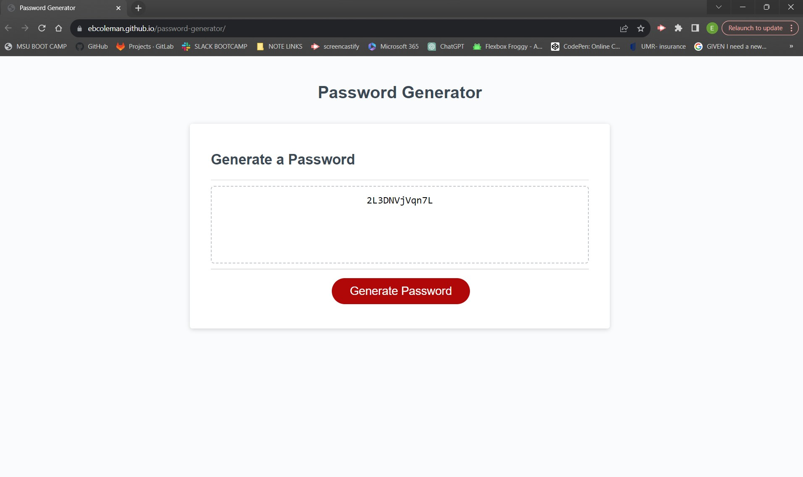

<!-- make my own README and make sure the starter code gets creditted -->
# Password Generator

## Description

With starter code, I will be writing code for JavaScript to make a functioning password generator. The password must be between 8 and 128 characters; the user will be given the option to pick how many characters and what they will be. They can choose any variation of uppercase letters, lowercase letters, numbers and symbols. If the password criteria is not met an alert should display. 

## Usage

Screenshot:

Link:
https://ebcoleman.github.io/password-generator/

## Credits

<!--STARTER CODE FOR PASSWORD GENERATOR-->
https://github.com/coding-boot-camp/friendly-parakeet

https://www.geeksforgeeks.org/how-to-generate-a-random-password-using-javascript/
https://stackoverflow.com/questions/75166534/how-do-i-use-a-loop-to-pick-random-characters-from-an-array

